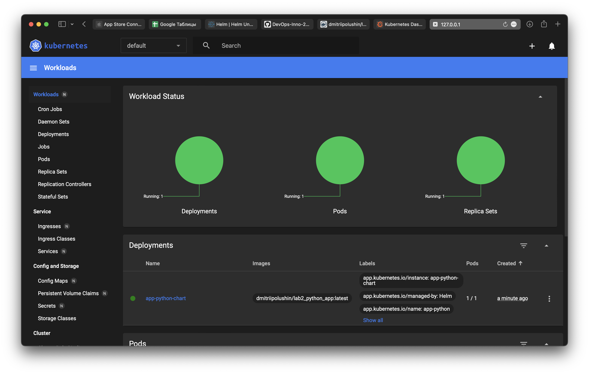

# Outputs without config file

```
> kubectl get pods,svc                                                                             [16:23:46]
NAME                              READY   STATUS    RESTARTS   AGE
pod/python-app-5f85575cc8-jvgp7   1/1     Running   0          17m
pod/web-cdcb85ddc-2b4s6           1/1     Running   0          15m

NAME                 TYPE           CLUSTER-IP      EXTERNAL-IP   PORT(S)          AGE
service/kubernetes   ClusterIP      10.96.0.1       <none>        443/TCP          34m
service/python-app   LoadBalancer   10.97.158.83    <pending>     8080:30457/TCP   2m6s
service/web          NodePort       10.110.20.139   <none>        8080:32737/TCP   26m
```

# Outputs with config file

```
> kubectl get pods,svc                                                                             [17:20:51]
NAME                                 READY   STATUS    RESTARTS   AGE
pod/app-deployment-dcc8bf8d8-fp7md   1/1     Running   0          12m
pod/app-deployment-dcc8bf8d8-hlfc8   1/1     Running   0          12m
pod/app-deployment-dcc8bf8d8-vvhpl   1/1     Running   0          12m

NAME                 TYPE           CLUSTER-IP       EXTERNAL-IP   PORT(S)          AGE
service/kubernetes   ClusterIP      10.96.0.1        <none>        443/TCP          70m
service/python-app   LoadBalancer   10.106.138.236   <pending>     8000:30749/TCP   3s
```

```
> minikube service --all                                                                           [17:20:54]
|-----------|------------|-------------|--------------|
| NAMESPACE |    NAME    | TARGET PORT |     URL      |
|-----------|------------|-------------|--------------|
| default   | kubernetes |             | No node port |
|-----------|------------|-------------|--------------|
😿  service default/kubernetes has no node port
|-----------|------------|-------------|---------------------------|
| NAMESPACE |    NAME    | TARGET PORT |            URL            |
|-----------|------------|-------------|---------------------------|
| default   | python-app |        8000 | http://192.168.49.2:30749 |
|-----------|------------|-------------|---------------------------|
🏃  Starting tunnel for service kubernetes.
🏃  Starting tunnel for service python-app.
|-----------|------------|-------------|------------------------|
| NAMESPACE |    NAME    | TARGET PORT |          URL           |
|-----------|------------|-------------|------------------------|
| default   | kubernetes |             | http://127.0.0.1:54263 |
| default   | python-app |             | http://127.0.0.1:54265 |
|-----------|------------|-------------|------------------------|
🎉  Opening service default/kubernetes in default browser...
🎉  Opening service default/python-app in default browser...
❗  Because you are using a Docker driver on darwin, the terminal needs to be open to run it.
```

# Lab 10

```
> kubectl get pods,svc                                                                                                             [10:18:39]
NAME                                    READY   STATUS    RESTARTS   AGE
pod/app-python-chart-6dff5874b8-5sblc   1/1     Running   0          2m36s

NAME                       TYPE        CLUSTER-IP     EXTERNAL-IP   PORT(S)    AGE
service/app-python-chart   ClusterIP   10.102.5.130   <none>        8000/TCP   2m37s
service/kubernetes         ClusterIP   10.96.0.1      <none>        443/TCP    13h
```

