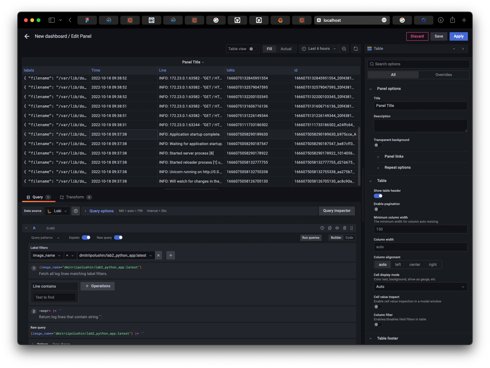

# Grafana Loki logging report

## Steps to check that system work

1. `docker compose build`
2. `docker compose up`
3. go to http://localhost:3000
4. go to Add source
5. in url field enter http://loki:3100
6. go to explore or dashboard, then apply label filters by `image_name`

## Grafana dashboard with app logs

